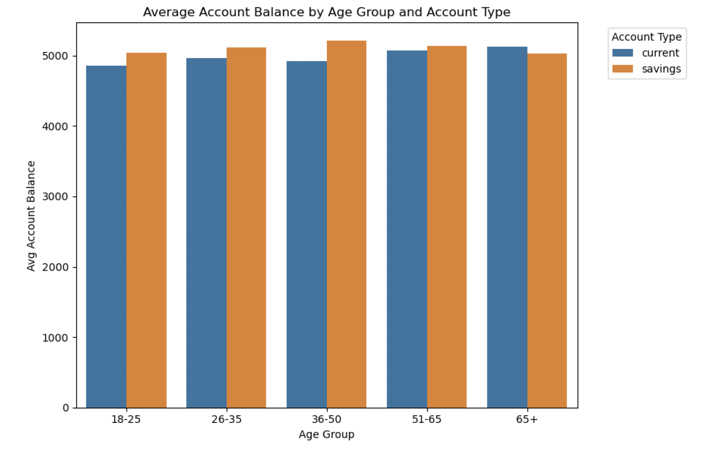
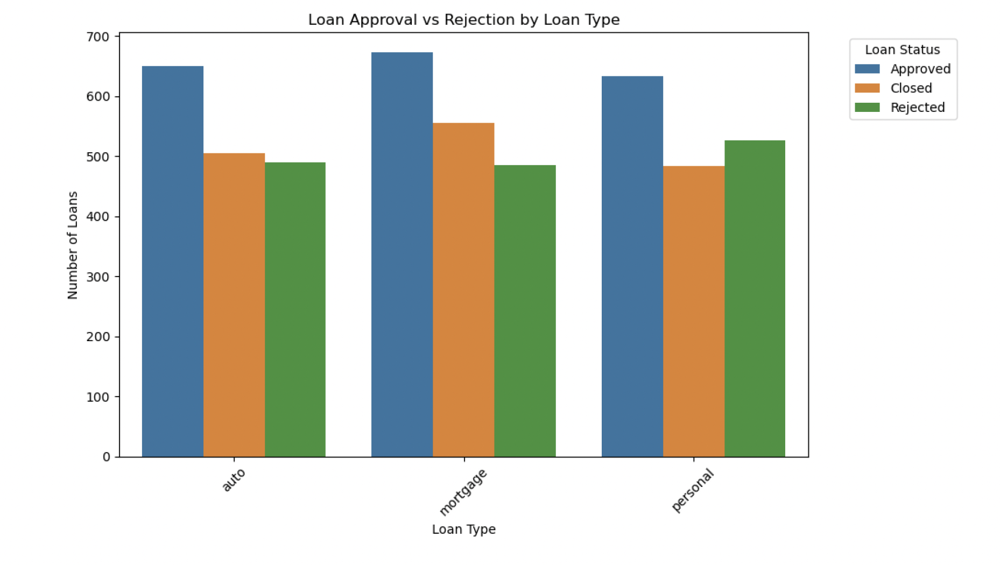

# Retail Banking Analytics – Customer, Loan & Credit Insights

## Overview
This project analyzes retail banking data to understand **customer financial behavior, loan performance, and credit utilization**.  
The goal is to derive **business-relevant KPIs and insights** that support lending decisions, customer segmentation, and risk assessment.

---

## Dataset
The analysis is based on structured banking data covering:
- Customers and demographics
- Savings and current accounts
- Loans and credit cards
- Transactions and loan status

---

## Analysis Focus
Key focus areas include:
- Customer balance patterns across age groups  
- Loan approval and rejection trends by loan type  
- Credit utilization behavior and lending KPIs  

---

## Exploratory Data Analysis (EDA)

### 1. Average Account Balance by Age Group and Account Type

**Insight:**  
Customers aged **36–50** and **51–65** maintain higher average balances, especially in savings accounts, indicating stronger financial stability during mid to late career stages.

---

### 2. Loan Approval vs Rejection by Loan Type

**Insight:**  
Mortgage loans show higher approval volumes, while **personal loans have comparatively higher rejection counts**, reflecting stricter risk evaluation for unsecured lending.

---

## Power BI Dashboard
A Power BI dashboard was built to provide a consolidated view of **loan performance, credit utilization, and key lending KPIs**.

**Dashboard Highlights**
- Total Loan Amount issued  
- Loan Approval Rate  
- Average Credit Utilization  
- Loan status distribution (Approved, Closed, Rejected)  
- Loan amount by loan type  
- Credit utilization distribution  

📊 **Power BI File**: `powerbi/retail_banking_dashboard.pbix`

---

## Tools & Technologies
- **SQL** (database schema and table creation)
- **Python** (Pandas, NumPy, Matplotlib)
- **Jupyter Notebook** for analysis
- **Power BI** for interactive dashboards
- **GitHub** for version control

---

## Business Impact
- Identified financially strong customer segments for targeted banking strategies  
- Highlighted loan types with higher rejection risk  
- Enabled KPI-driven monitoring of lending and credit utilization  
- Supported data-backed decision-making for retail banking operations
